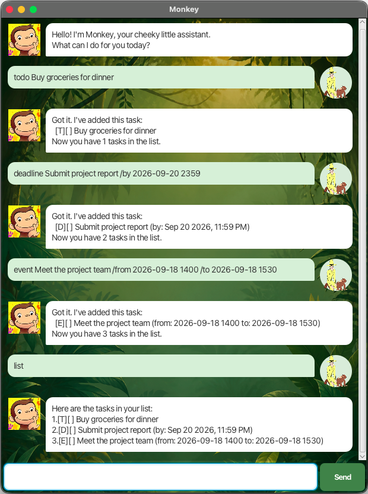

# Monkey User Guide

Monkey is a cheeky desktop chatbot that helps you capture todos, deadlines, and
events using short text commands. It saves every change automatically, so your
tasks are waiting for you when you return.



## Quick start

1. Ensure that Java 25 is installed on your computer.
2. Place `monkey.jar` in the folder where you want Monkey to keep its data.
3. Open a terminal in that folder and run `java -jar monkey.jar`.
4. Type a command in the box at the bottom of the window and press <kbd>Enter</kbd>
   or click **Send**.

Monkey creates `data/monkey.txt` automatically in that folder. Avoid editing
this file directly while Monkey is running.

## Reading this guide

- Words in `UPPER_CASE` are values you supply. For example, replace
  `DESCRIPTION` with the task you want to remember.
- Task numbers come from the `list` command.
- `[T]`, `[D]`, and `[E]` identify todos, deadlines, and events. `[X]` means a
  task is complete, while `[ ]` means it is incomplete.
- Commands are lowercase. Extra spaces are ignored.

## Features

### Adding a todo: `todo`

Adds a task without a date or time.

Format: `todo DESCRIPTION`

Example: `todo Buy groceries for dinner`

```text
Got it. I've added this task:
  [T][ ] Buy groceries for dinner
Now you have 1 tasks in the list.
```

### Adding a deadline: `deadline`

Adds a task that must be completed by a date or date-time.

Format: `deadline DESCRIPTION /by DATE_OR_DATETIME`

Examples:

- `deadline Submit report /by 2026-09-20`
- `deadline Submit report /by 20/9/2026 2359`

Dates can use `yyyy-MM-dd` or `d/M/yyyy`. Add a 24-hour time as `HHmm` when
needed. Monkey displays valid deadlines in a friendlier format.

```text
Got it. I've added this task:
  [D][ ] Submit report (by: Sep 20 2026)
Now you have 1 tasks in the list.
```

Use exactly one `/by` marker in each deadline.

### Adding an event: `event`

Adds a task with a start and an end.

Format: `event DESCRIPTION /from START /to END`

Examples:

- `event Project meeting /from 2pm /to 3:30pm`
- `event Conference /from 2026-10-03 0900 /to 2026-10-03 1700`

For dates and date-times, use `yyyy-MM-dd` or `d/M/yyyy`; write 24-hour times as
`HHmm`. You can also use 12-hour times such as `2pm` or `3:30pm`. The end must
be later than the start. Use one `/from` marker followed by one `/to` marker.

### Listing all tasks: `list`

Shows every saved task and its task number.

Format: `list`

```text
Here are the tasks in your list:
1.[T][ ] Buy groceries for dinner
2.[D][ ] Submit report (by: Sep 20 2026)
```

Run `list` before commands that need a task number if you are unsure which
number to use.

### Finding tasks: `find`

Shows tasks whose descriptions contain the given keyword. Matching is not
case-sensitive.

Format: `find KEYWORD`

Example: `find report`

```text
Here are the matching tasks in your list:
1.[D][ ] Submit report (by: Sep 20 2026)
```

The numbers in these results count the matches; use `list` to get the task
number for `mark`, `unmark`, `delete`, or `snooze`.

### Marking a task as complete: `mark`

Marks the task at the given number as done.

Format: `mark TASK_NUMBER`

Example: `mark 2`

```text
Nice! I've marked this task as done:
  [D][X] Submit report (by: Sep 20 2026)
```

### Marking a task as incomplete: `unmark`

Changes a completed task back to incomplete.

Format: `unmark TASK_NUMBER`

Example: `unmark 2`

### Deleting a task: `delete`

Permanently removes the task at the given number. Remaining tasks are
renumbered.

Format: `delete TASK_NUMBER`

Example: `delete 1`

```text
Noted. I've removed this task:
  [T][ ] Buy groceries for dinner
Now you have 1 tasks in the list.
```

### Snoozing a deadline: `snooze`

Moves an incomplete deadline to a new future date or date-time.

Format: `snooze TASK_NUMBER DATE_OR_DATETIME`

Example: `snooze 1 2099-10-01 1800`

```text
Snoozed this task to Oct 01 2099, 6:00 PM:
  [D][ ] Submit report (by: Oct 01 2099, 6:00 PM)
```

The same date formats used by `deadline` are supported. Todos, events,
completed deadlines, and dates that are not in the future cannot be snoozed.

### Exiting Monkey: `bye`

Closes Monkey. Your tasks have already been saved.

Format: `bye`

## Input rules and recovery

- A task must have a description, and a description cannot contain `|`.
- Monkey rejects an exact duplicate of an existing task. Differences in letter
  case or repeated spaces do not make a task unique.
- `list` and `bye` do not accept extra arguments. `find` requires a keyword.
- If Monkey finds damaged or duplicate entries in its save file, it keeps the
  valid tasks and tells you which data it ignored.
- If a change cannot be saved, Monkey leaves the task list unchanged.

## Command summary

| Action | Command |
| --- | --- |
| Add a todo | `todo DESCRIPTION` |
| Add a deadline | `deadline DESCRIPTION /by DATE_OR_DATETIME` |
| Add an event | `event DESCRIPTION /from START /to END` |
| List tasks | `list` |
| Find tasks | `find KEYWORD` |
| Mark complete | `mark TASK_NUMBER` |
| Mark incomplete | `unmark TASK_NUMBER` |
| Delete a task | `delete TASK_NUMBER` |
| Snooze a deadline | `snooze TASK_NUMBER DATE_OR_DATETIME` |
| Exit Monkey | `bye` |
